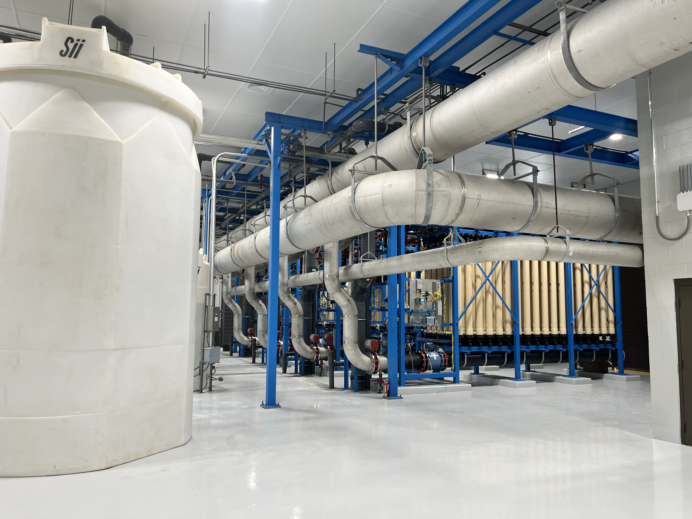

# Walker County Unveils State-of-the-Art Drinking Water Treatment Facility 💧

Walker County Water & Sewerage Authority (WCSWA) is proud to announce the successful completion and activation of its new **Drinking Water Treatment Facility (DWTF)**. This significant infrastructure upgrade marks a new era of enhanced water quality and capacity for our community.

---

## The New Facility Entrance
Here's a look at the impressive exterior of the new Walker County Drinking Water Treatment Facility:

---

## Project Leadership and Scope

This ambitious project was managed and overseen by Randall Haney, Superintendent and Drinking Water Treatment Facility Upgrade Project Manager for the Walker County Water & Sewerage Authority.

The new facility represents a fundamental transformation from the previous infrastructure:

* **Previous Facility:** A **4.5 Million Gallons per Day (MGD) Diatomaceous Earth (DE)** treatment plant.
* **New Facility:** A modern **12 MGD Membrane Filtration** plant.

This substantial increase in capacity ensures that Walker County can reliably meet the current and future water demands of its residents and businesses. Furthermore, the facility design includes room for future expansion, allowing for an ultimate capacity of **15 MGD** as the community continues to grow.

---

## Engineering Excellence and Technology

The engineering for this critical upgrade was expertly handled by Jerry Hightower with **CTI Engineering**. Their design incorporated cutting-edge water treatment technology, transitioning from the older DE system to highly efficient **membrane filtration**.

Here's an inside look at some of the advanced membrane filtration equipment:

**Membrane filtration** offers several key advantages over conventional methods:

The heart of our new plant is the advanced filtration system utilizing Pall Micro Membranes. Pall is a global leader in filtration technology, and these membranes provide significant operational and water quality benefits:

Absolute Barrier: The Pall micro-membranes act as an absolute physical barrier, ensuring 100% removal of cryptosporidium, giardia, and other microbial contaminants. This provides unmatched protection against waterborne disease and ensures compliance with the most stringent EPA regulations.

Increased Efficiency: The system is designed for optimal performance, minimizing waste and energy use compared to older technologies. Furthermore, the membranes allow for higher flux rates (water processed per unit area), contributing directly to the plant's expanded 12 MGD capacity.

Reliability and Automation: The robust membrane modules and automated backwash and cleaning cycles ensure consistent, high-quality water production with less susceptibility to fluctuations in raw water quality and requiring less chemical pretreatment.

Superior Water Quality: Membranes result in significantly lower turbidity (water cloudiness) than traditional filtration, consistently producing drinking water that is crystal clear and exceptionally safe.
---

## Serving the Community

Walker County Water & Sewerage Authority are pleased to confirm that the new 12 MGD Membrane Plant is **now fully online and operational**, successfully integrating into the WCSWA water distribution system.

This upgrade is a testament to Walker County Water & Sewerage Authority’s commitment to providing safe, reliable, and high-quality drinking water. We look forward to serving the community with this state-of-the-art facility for decades to come.

---

*For further information regarding the new facility or the Walker County Water & Sewerage Authority, please contact WCSWA during business hours, Monday - Friday 8:30 AM - 4:30 PM (706) 820-.1455*
Walker County Water &amp; Sewerage Authority's major upgrade from a 4.5 MGD Diatomaceous Earth plant to a new 12 MGD Membrane Filtration Facility.
